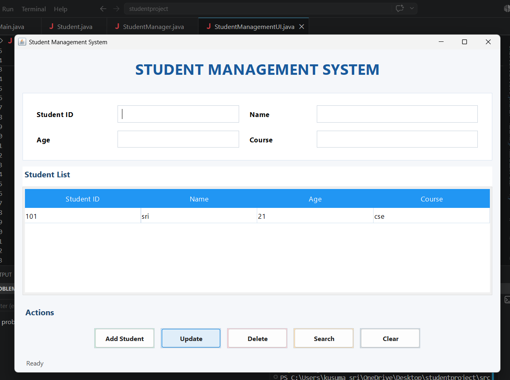

# Student Management System

## Description

Student Management System is a desktop application developed using Java Swing. It allows users to manage student records through a simple graphical interface. The application supports basic CRUD operations such as adding, searching, updating, and deleting student records.

## Features

- Add Student
- Search Student
- Update Student
- Delete Student
- Display Student Records in a Table
- Clear Input Fields
- Duplicate Student ID Validation
- User-Friendly Interface

## Technologies Used

- Java
- Java Swing
- Object-Oriented Programming (OOP)
- ArrayList

## Project Structure

```
StudentProject
│
├── src
│   ├── Main.java
│   ├── Student.java
│   ├── StudentManager.java
│   └── StudentManagementUI.java
│
├── README.md
└── .gitignore
```

## How to Run

Compile the project:

```bash
javac *.java
```

Run the application:

```bash
java Main
```

## Screenshot

Place the application screenshot inside a folder named `screenshots`.

Example:

```
screenshots/
    home.png
```

Display it in the README using:

```markdown

```

## Future Enhancements

- Database Integration using MySQL
- Login Authentication
- Export Data to PDF or Excel
- Student Attendance Management
- Student Photo Upload
- Dashboard with Statistics

## Learning Outcomes

This project helped in understanding:

- Java Swing
- Event Handling
- Object-Oriented Programming
- ArrayList
- CRUD Operations
- Java Project Structure

## Author

Kusuma Sri

Computer Science Engineering Student